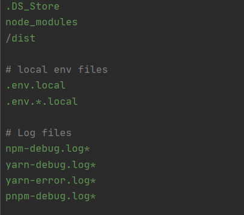

## Файл .gitignore
Иногда существуют файлы, которые нельзя добавлять в репозиторий. Это могут быть локальные настройки проекта, учётные данные, сведения об ошибках, библиотеки, промежуточные результаты компиляции и другие. Такие файлы требуется добавлять в игнорируемые для GIT.

**Описание файла**
---
Файл с описанием файлов, для которых не должно вестись отслеживание версий, имеет расширение ```.gitignore.``` Файл ```.gitignore``` представляет собой текстовый файл с перечнем шаблонов файловых имён, которые не должны отслеживаться.

Основные правила синтаксиса этого файла:

1. Одна строчка — один шаблон.
2. Пустые строки игнорируются.
3. Чтобы написать комментарий, в начале строки укажите знак #.
4. Символ / в начале строки указывает, что правило применяется ТОЛЬКО к файлам и каталогам, которые располагаются в том же каталоге, что и сам файл ```.gitignore.```
5. Доступно использование спецсимволов:

  5.1 Звёздочка ```*``` заменяет любое количество символов (в том числе и ноль). Например, правило ```*.avi``` будет игнорировать все файлы с расширением ```.avi```;

  5.2 Знак вопроса ```?``` заменяет любой 1 символ. Можно размещать в любом месте правила;
  5.3 Две звёздочки ```**``` используются для указания любого количества подкаталогов. Например, ```alex/**/account.txt``` — будут игнорироваться все файлы в каталоге ```alex``` и во всех вложенных в него каталогах;

  5.4 Восклицательный знак ```!``` в начале строки означает инвертирование правила;

  5.5 Символ ```\``` используется для экранирования спецсимволов;

  5.6 Символ ```/``` используется для разделения уровня каталогов.

  

  В проекте может быть создано любое количество файлов ```.gitignore```, однако обычно достаточно одного файла в корне проекта.